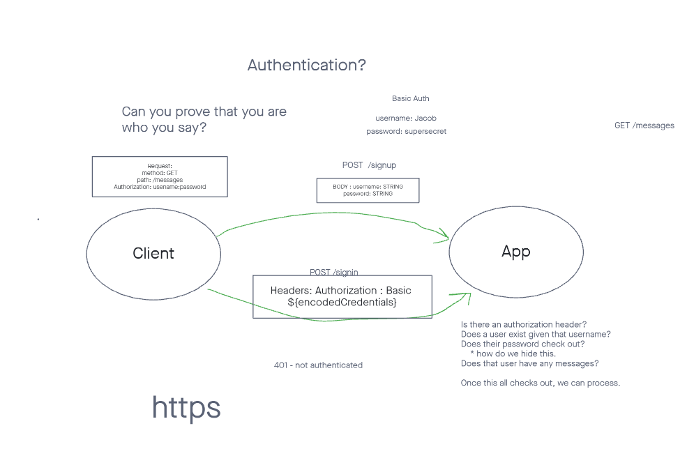

# basic-auth

## Live Deploy
[Heroku](https://alfredo-basic-auth.herokuapp.com/)

## Deployment
How do I install the app or library?
  All you need to do is git clone my repository
How do I test the app or library?
  npm test basic-auth
For Applications:
How do I run the app?
  npm start
How do I set up the app?
  Install all of the dependencies

## Testing
[TESTS](./__tests__)

## Documentation

## Routing
Run "npm test" in the terminal to test routes. You can also test these routes in thunder client:
/signup
/signin